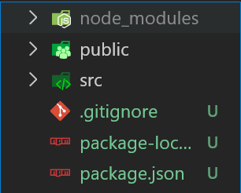
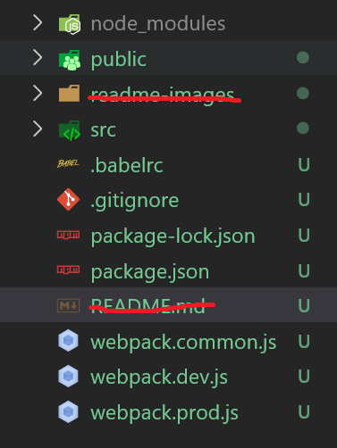
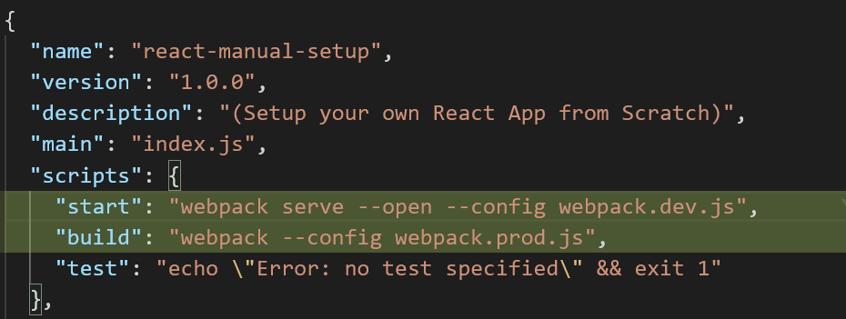
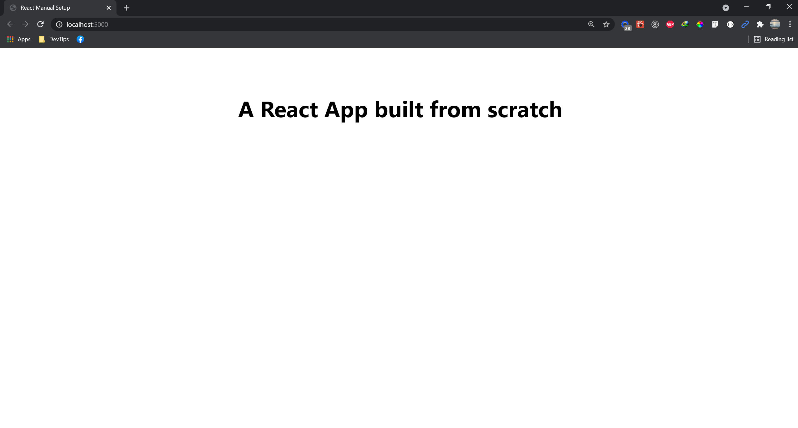

## React Manual Setup

(Setup your own React App from Scratch)

---

##### _You can just clone this project and start writing your React Application after installing the dependencies with_

```
npm install
```

##### _But if you want to learn how to set things up manually by yourself, below are the steps._

#### Steps:

1. Open up your terminal and cd into your project's directory

2. Initialize npm and git
   `npm init -y`
   `git init`

3. Create a "**.gitignore**" file and ignore the files below:

   ```
   node_modules/
   build/
   ```

- **_Installing necessary packages_**

4. Install **React** and **React DOM**
   `npm install react react-dom`
   <br>
5. Install **module bundler** & **plugins** (Webpack)
   `npm install webpack webpack-cli webpack-dev-server webpack-merge html-webpack-plugin`
   <br>
6. Install **transpiler/compiler** (Babel)
   `npm install @babel/core @babel/cli @babel/preset-env @babel/preset-react`
   <br>

7. Install **loaders**, 'cause we need them to load **styles** (.css), and **files** (.babelrc, .jpeg, .png, .svg, etc.)  
   `npm install style-loader css-loader file-loader babel-loader`
   <br>

- _**After the installation...**_

8. Create two new folders at the root of the project, name it "**src**" & "**public**" .

   - The **src** folder will be the **entry point** of our React app.
   - The **public** folder is where we are serving our app from.

Your project's file structure should look like this if you didn't change any names



<br><br>

9. Let's create the html template for our App.
   Create a new file called "**index.html**" inside of the "**public**" folder. Then copy and paste the code below

   ```
   <!DOCTYPE html>
   <html lang="en">
    <head>
        <meta charset="utf-8" />
        <meta name="viewport" content="width=device-width, initial-scale=1" />
        <meta name="description" content="React App from scratch" />

        <title>React Manual Setup</title>
    </head>

    <body>
        <noscript>You need to enable JavaScript to run this app.</noscript>
        <div id="root"></div>
        <!--
          This HTML file is a template.
          If you open it directly in the browser, you will see an empty page.

          You can add webfonts, meta tags, or analytics to this file.
          The build step will place the bundled scripts into the <body> tag.

          To begin the development, run `npm start` or `yarn start`.
          To create a production bundle, use `npm run build` or `yarn build`.
        -->
    </body>

    </html>
   ```

10. After creating the html template, you can now write your React (.js) files inside of the "**src**" folder.
    Let's create a new **index.js** file inside **src** folder. Then add the code below.
    Here, we're just rendering a simple \<h2> tag with text

    ```
     import React from "react";
     import ReactDOM from "react-dom";

     ReactDOM.render(
       <h2 style={{ textAlign: "center", marginTop: "2em" }}>
         A React App built from scratch
       </h2>,
       document.getElementById("root")
     );
    ```

Now, we only need some configuration before we can actually run our React App

11. Create a file called "**webpack.common.js**" at the root of your project. Then, copy and paste the code below. This will be our shared configuration between development and production

```
const path = require("path");
const HtmlWebpackPlugin = require("html-webpack-plugin");

module.exports = {
  entry: "./src/index.js",
  output: {
    path: path.resolve(__dirname, "build/"),
    filename: "[name].js",
    // clean: true,
  },
  module: {
    rules: [
      {
        test: /\.js$/,
        exclude: /(node_modules|bower_components)/,
        loader: "babel-loader",
        options: {
          presets: ["@babel/env"],
        },
      },
      {
        test: /\.css$/,
        use: ["style-loader", "css-loader"],
      },
      {
        test: /(\.png|jpe?g|gif)$/,
        loader: "file-loader",
        options: {
          outputPath: "./images",
        },
      },

      {
        test: /\.svg$/,
        loader: "file-loader",
        options: {
          outputPath: "./svgs",
        },
      },
    ],
  },
  resolve: { extensions: ["*", ".js", ".jsx"] },
  plugins: [new HtmlWebpackPlugin({ template: "./public/index.html" })],
};
```

12. Repeat the previous step for "**webpack.dev.js**". This will be our development configuration.

```
const { merge } = require("webpack-merge");
const common = require("./webpack.common.js");
const path = require("path");

module.exports = merge(common, {
  mode: "development",
  devtool: "inline-source-map",
  devServer: {
    contentBase: [
      path.join(__dirname, "public"),
      path.join(__dirname, "src/assets"),
    ],
    port: 5000,
    compress: true,
  },
});
```

13. Lastly, do the same thing again for "**webpack.prod.js**". This will be our production configuration.

```const { merge } = require("webpack-merge");
const common = require("./webpack.common.js");

module.exports = merge(common, {
  mode: "production",
});
```

14. Let's not forget the babel config! Create a new "**.babelrc**" file, at the project's root again. Then, copy and paste this code

```
{
    "presets": [
        "@babel/env",
        "@babel/preset-react"
    ]
}
```

So far, this is what our file structure looks like. Just ignore the "**readme-images**" folder and "README.md".



_Hang on... We are getting close to the end_
<br> <br>

15. Add the needed scripts to start your React App in your "**package.json**" file.

    - "**start**" - to start our React app development server
    - "**build**" - to generate optimized static files needed for production

```
"start": "webpack serve --open --config webpack.dev.js",
"build": "webpack --config webpack.prod.js",
```



<br> <br>

16. You can now run your React App pretty much the same as how you run your create-react-app (CRA)

```
npm start
```

```
npm run build
```

<br>

#### VIOLA! Your freshly baked React App, with less boilerplates


